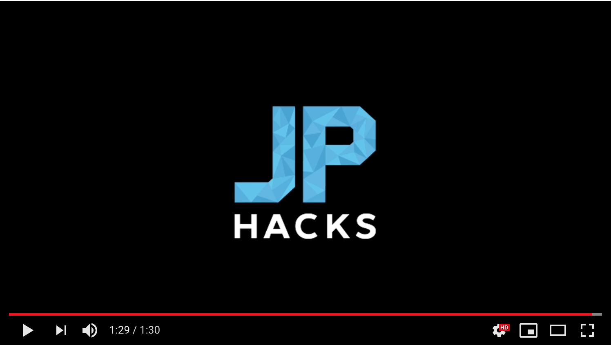

# PITCH ME

## 製品概要
### 音楽練習 x Tech

### 背景（製品開発のきっかけ、課題等）

楽器を弾くためには、長期間の練習が必要になります。
独学で練習している場合、曲が演奏できないときなど、
練習が嫌になったりします。

また、練習をしても誰かと演奏したりする機会がないため、
モチベーションが続かなかったりします。

そういった現状を踏まえて、楽器の練習が楽しくなるようなサービスを
開発しようと考えました。

楽器練習用のログアプリで既存のサービスでは存在します。また、
バンドメンバーを探すサービスは現在掲示板のようなものしかなく、
相手の技量や、音楽の趣味などがわかりません。

### 製品説明（具体的な製品の説明）
youtubeにアップロードした映像と楽器、楽譜を登録することで、
練習のログを取ることができます。

また他の人が開いたセッションに参加して、同時に演奏することができます。

### 特長

#### 1. 特長1
練習のログが取れる。同じ曲を練習している他の人の練習を見ることができる。

#### 2. 特長2
他の人とweb上でセッションできる。

#### 3. 特長3

### 解決出来ること
練習のモチベーションを上げることができる。

### 今後の展望
検索機能が間に合わなかったので、そこを作りたいです。

また、live sessionができるように、フォロー機能など、SNSとして使えるようにしていきたいです。

## 開発内容・開発技術
### 活用した技術
#### API・データ
今回スポンサーから提供されたAPI、製品などの外部技術があれば記述をして下さい。

* ありません

#### フレームワーク・ライブラリ・モジュール
* Ruby on Rails

#### デバイス
* ありません

### 研究内容・事前開発プロダクト（任意）
ご自身やチームの研究内容や、事前に持ち込みをしたプロダクトがある場合は、こちらに実績なども含め記載をして下さい。

* 
* ありません

### 独自開発技術（Hack Dayで開発したもの）
#### 2日間に開発した独自の機能・技術
* 機能全て
* 一部デザイン
